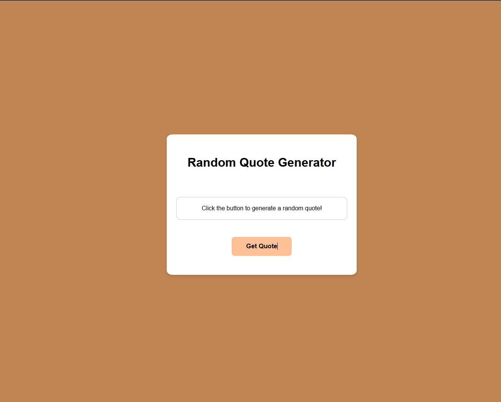

# 💬 Random Quote Generator

A clean, minimal web app that displays a random inspirational quote each time you click the button.

## 📸 Preview


> Click **Get Quote** and get inspired by a randomly selected motivational quote, styled with a smooth animated star-burst button effect.

##  Features

- Displays a random quote from a curated list on button click
- Animated star-burst button effect on hover (via [Uiverse.io](https://uiverse.io))
- Clean, card-based UI with a warm color palette
- Lightweight — pure HTML, CSS, and vanilla JavaScript, no dependencies

## Project Structure

```
random-quote-generator/
├── index.html      # App markup and button component
├── style.css       # Styling and button animations
└── script.js       # Quote logic and DOM interaction
```

## 🛠️ How It Works

1. A `quotes` array in `script.js` holds the list of quotes.
2. When the **Get Quote** button is clicked, a random index is picked using `Math.random()`.
3. The selected quote is injected into the `#quote` paragraph and italicized.

## Quotes Included

| Quote | Author |
|-------|--------|
| "The only way to do great work is to love what you do." | Steve Jobs |
| "Success is not final, failure is not fatal..." | Winston Churchill |
| "Believe you can and you're halfway there." | Theodore Roosevelt |
| "Don't watch the clock; do what it does. Keep going." | Sam Levenson |
| "The future belongs to those who believe in the beauty of their dreams." | Eleanor Roosevelt |

##  Getting Started

No build tools or installations needed.

1. **Clone or download** this repository.
2. Open `index.html` in any modern browser.
3. Click **Get Quote** and enjoy!

```bash
git clone https://github.com/abdullahameen360/random-quote-generator.git
cd random-quote-generator
open index.html
```

## Customization

**Add your own quotes** — open `script.js` and extend the `quotes` array:

```javascript
let quotes = [
    "Your new quote here. - Author Name",
    // ... existing quotes
];
```

**Change the color scheme** — the warm brown palette is defined in `style.css`:

```css
body {
    background-color: #C08552; /* Main background */
}
button {
    background: #fec195;      /* Button color */
}
```

## 🧰 Built With

- HTML5
- CSS3 (Flexbox, transitions, animations)
- Vanilla JavaScript (ES6)
- Button design from [Uiverse.io](https://uiverse.io) by MuhammadHasann

## 📄 License

This project is open source and available under the [MIT License](LICENSE).
